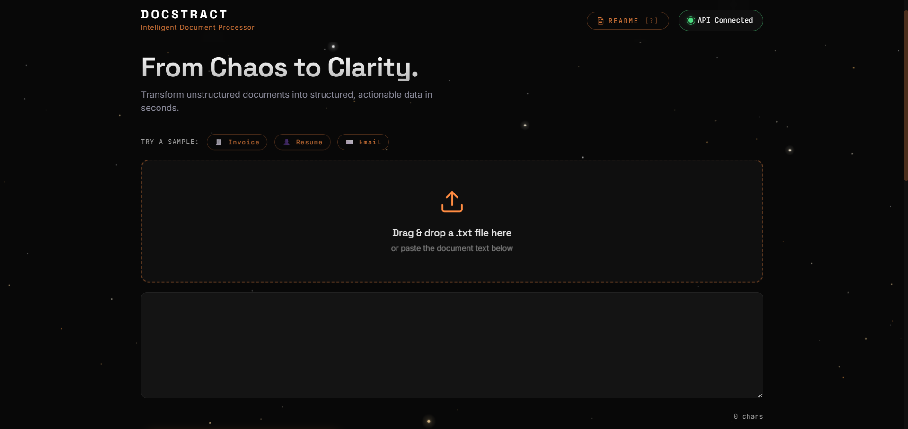
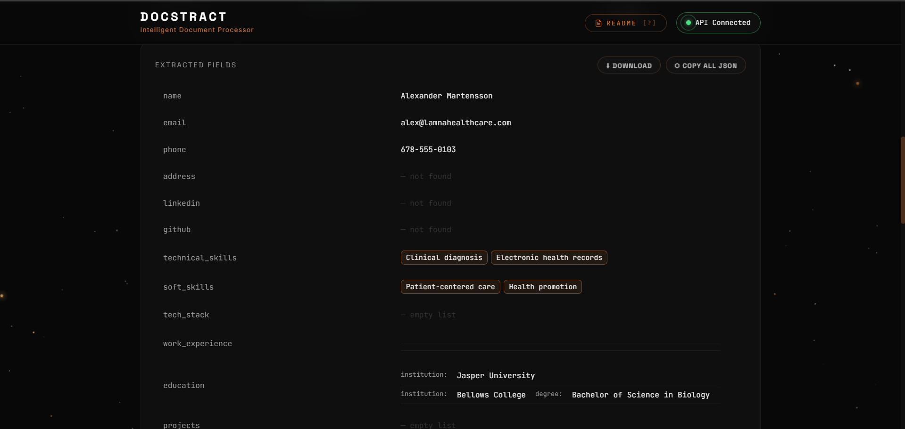
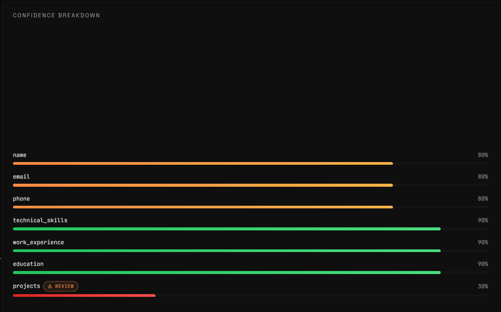
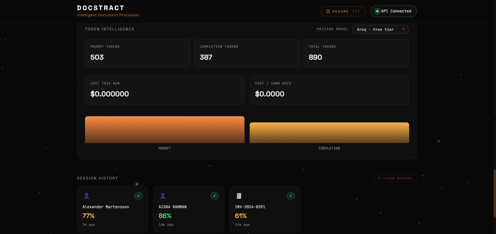
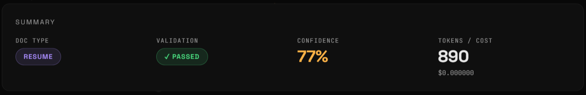

# 📄 Docstract — Intelligent Document Processor

> *From Chaos to Clarity. Transform unstructured documents into structured, actionable data in seconds.*

**Docstract** is a production-grade AI document extraction pipeline that takes raw invoices, resumes, and emails, extracts all structured fields using an LLM, validates the output using business logic, scores confidence per field, and flags uncertain fields for human review.

🔗 **Live Demo:** [https://docstract-785p.onrender.com](https://docstract-785p.onrender.com)
🐙 **GitHub:** [https://github.com/SphinX-2738/docstract](https://github.com/SphinX-2738/docstract)

---

## 🖼️ Screenshots

### Landing Page


### Resume Extraction


### Confidence Breakdown


### Token Intelligence


### Summary Panel


---

## 🚀 What This Does

Most document processing tools just dump raw text. Docstract goes further:

1. **Extracts** — Sends raw text to Qwen 3.6 27B via Groq API with schema-aware prompts
2. **Validates** — Runs business logic checks (math verification, GSTIN format, required fields)
3. **Scores** — Assigns per-field confidence scores (0–100%) and flags anything below 70% for human review
4. **Reports** — Generates structured JSON, batch CSV reports, and a full terminal report

---

## 🧠 Core Concepts Demonstrated

- **LLM Extraction** — Schema-aware prompts that tell the LLM exactly what structure to return
- **Pydantic Validation** — Type-safe schemas that catch wrong types, missing fields, and invalid formats
- **Business Logic Validation** — Math checks (subtotal + tax = total), GSTIN format validation, required field checks
- **Confidence Scoring** — Per-field reliability scores with human-in-the-loop flagging
- **Semantic Search** — ChromaDB + sentence-transformers for large document handling (chunk → embed → retrieve → extract)
- **Batch Processing** — Process entire folders of documents with cost tracking and archival
- **Provider-agnostic Cost Registry** — Switch models in one line, costs recalculate automatically across 9 providers

---

## 🏗️ Architecture

```
Raw Document (text)
        ↓
┌─────────────────────────────────────┐
│           extractor.py              │
│  ┌─────────────────────────────┐   │
│  │  Short doc (< 500 words)    │   │
│  │  → Send full text to LLM   │   │
│  └─────────────────────────────┘   │
│  ┌─────────────────────────────┐   │
│  │  Large doc (> 500 words)    │   │
│  │  → chunk → embed → search  │   │
│  │  → Send top chunks to LLM  │   │
│  └─────────────────────────────┘   │
└─────────────────────────────────────┘
        ↓
   Pydantic Schema Validation
        ↓
   Business Logic Validation (validator.py)
        ↓
   Confidence Scoring (confidence.py)
        ↓
   Structured JSON Output
```

---

## 📁 Project Structure

```
docstract/
│
├── main.py                # FastAPI backend — 6 REST endpoints
├── config.py              # Central model/provider config
├── extractor.py           # LLM extraction with semantic search
├── validator.py           # Business logic validation
├── confidence.py          # Per-field confidence scoring
├── batch_processor.py     # Batch pipeline with cost tracking
├── report_generator.py    # Terminal + file report generation
├── chunker.py             # Document chunking for large files
├── embedder.py            # ChromaDB vector embeddings
├── semantic_search.py     # Semantic chunk retrieval
│
├── schemas/
│   ├── invoice.py         # Invoice Pydantic schema
│   ├── resume.py          # Resume Pydantic schema
│   └── email.py           # Email Pydantic schema
│
├── sample_documents/      # Sample invoices, resumes, emails
│   ├── invoices/
│   ├── resumes/
│   └── emails/
│
├── docstract.html         # Complete frontend (single file)
└── outputs/               # Auto-generated results
    ├── extracted/          # Per-document JSON results
    ├── batch_results/      # Batch CSV summaries
    ├── reports/            # Full text reports
    └── archive/            # Previous run archives
```

---

## ⚙️ Setup & Installation

### 1. Clone the repo
```bash
git clone https://github.com/SphinX-2738/docstract.git
cd docstract
```

### 2. Create virtual environment
```bash
python -m venv venv
venv\Scripts\activate        # Windows
# source venv/bin/activate   # Mac/Linux
```

### 3. Install dependencies
```bash
pip install -r requirements.txt
```

### 4. Set up environment variables
Create a `.env` file in the root:
```
GROQ_API_KEY=your_groq_api_key_here
```

Get a free Groq API key at [console.groq.com](https://console.groq.com)

### 5. Run the backend
```bash
python main.py
```

### 6. Open the frontend
Open `docstract.html` in your browser. The API Connected pill will turn green when the backend is running.

---

## 🔌 API Endpoints

| Method | Endpoint | Description |
|--------|----------|-------------|
| GET | `/health` | Health check |
| GET | `/providers` | List available LLM providers and pricing |
| POST | `/extract` | Extract from raw text |
| POST | `/extract/file` | Extract from uploaded file |
| GET | `/results` | List all extraction results |
| GET | `/results/{doc_id}` | Get specific result by ID |

### Example Request
```bash
curl -X POST http://localhost:8000/extract \
  -H "Content-Type: application/json" \
  -d '{
    "document": "Invoice from Nexcore Solutions...",
    "doc_type": "invoice",
    "doc_id": "inv_001"
  }'
```

---

## 🧪 Running Batch Processing

```bash
python batch_processor.py
```

Processes all documents in `sample_documents/`, generates per-document JSON, batch CSV, and archives previous runs automatically.

```bash
python report_generator.py
```

Generates a full terminal report + saves to `outputs/reports/`.

---

## 💰 Cost Analysis

Docstract runs on **Groq's free tier** — $0.00 per extraction. The Token Intelligence panel shows equivalent costs across 9 providers so you can make informed decisions when scaling:

| Provider | Cost / 1K docs |
|----------|---------------|
| Groq (Qwen 3.6 27B) | $0.00 (free) |
| OpenAI GPT-4o Mini | ~$0.15 |
| Anthropic Claude Haiku | ~$0.80 |
| Google Gemini Flash | ~$0.075 |

---

## 🛣️ Roadmap

- [ ] PDF support via `pdfplumber`
- [ ] Image/scanned document OCR via `pytesseract`
- [ ] DOCX resume parsing via `python-docx`
- [ ] Native `.eml` email parsing
- [ ] Direct Gmail/Outlook API integration
- [ ] GSTIN verification via GST Portal API
- [ ] Multi-language document support

---

## 🛠️ Tech Stack

| Layer | Technology |
|-------|-----------|
| LLM | Qwen 3.6 27B via Groq API |
| Backend | FastAPI + Python |
| Validation | Pydantic v2 |
| Vector DB | ChromaDB |
| Embeddings | sentence-transformers (all-MiniLM-L6-v2) |
| Frontend | Vanilla HTML/CSS/JS |
| Config | python-dotenv |

---

## 📊 Sample Results

Tested on 7 documents across 3 categories:

- ✅ **5/7 validation passed**
- 📊 **Average confidence: 69.0%**
- 🔢 **~900 tokens per extraction**
- 💰 **$0.00 actual cost (Groq free tier)**

---

**Ankur Sharma**
- GitHub: [@SphinX-2738](https://github.com/SphinX-2738)
- LinkedIn: [Ankur Sharma](https://www.linkedin.com/in/ankur-sharma-37a0a3276/)
